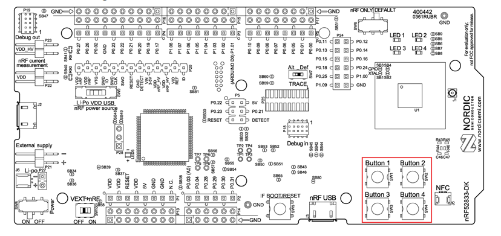
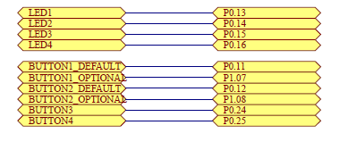

# nRF52840 LED Button Interrupt Example

This project demonstrates how to control multiple LEDs using button interrupts on the nRF52840 Development Kit (DK). The example is implemented using the Zephyr RTOS, leveraging the DeviceTree for hardware abstraction. The buttons' states are monitored using interrupts, and the LEDs are toggled accordingly.

---

## **Prerequisites**

- **Hardware**: Nordic Semiconductor nRF52840 DK
- **Software**: 
  - Zephyr SDK
  - Nordic Semiconductor nRF Connect SDK
- A basic understanding of GPIO operations and Zephyr's DeviceTree.

---

## **Features**

- Reads input from four buttons on the nRF52840 DK:
  - **Button 1**: Toggles **LED 1**.
  - **Button 2**: Toggles **LED 2**.
  - **Button 3**: Toggles **LED 3**.
  - **Button 4**: Toggles **LED 4**.
- Implements an interrupt mechanism for efficient button press detection.
- Modular code structure with separate files for buttons and LEDs.

---

## **Hardware Setup**

### **Button and LED Mapping**
The code uses the following mappings:
- **Button 1** (`sw0`): Toggles **LED 1** (`led0`).
- **Button 2** (`sw1`): Toggles **LED 2** (`led1`).
- **Button 3** (`sw2`): Toggles **LED 3** (`led2`).
- **Button 4** (`sw3`): Toggles **LED 4** (`led3`).

### **Buttons Locations**

### **Button Pin Mapping**

## **Code Structure**

### **Main Application (`main.c`)**
Handles the interrupt setup, button state reading, and LED updates based on the button logic.

### **Buttons Module (`buttons.c` and `buttons.h`)**
- Initializes button GPIOs.
- Configures interrupts for button presses.

## 🔗 Quick Links

- [📁 Back to Nordic-Semiconductor Projects](https://github.com/Amid68/Amid68/blob/main/projects/embedded_projects.md#nordic-semiconductor-nrf52840)

